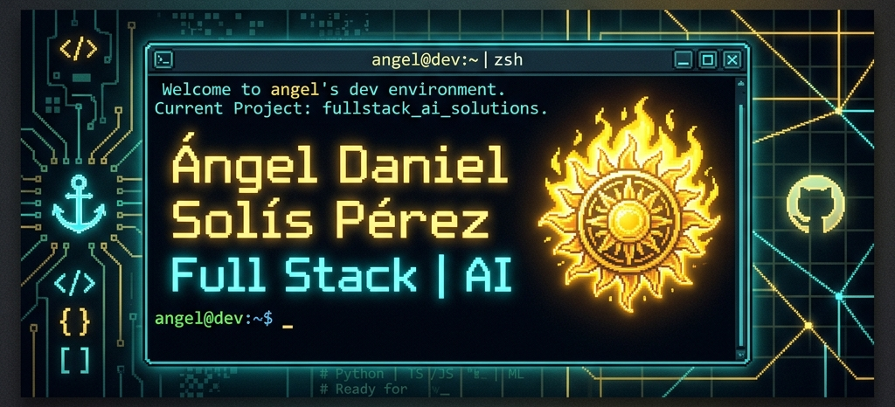

  

📍 Campeche, México

## 🧠 Sobre mí

Soy estudiante de **Ingeniería en Sistemas Computacionales** enfocado en el desarrollo web, donde busco combinar funcionalidad, estructura y diseño en cada proyecto. Aprendo mediante la práctica, construyendo proyectos reales y mejorando continuamente mi forma de desarrollar.

| 🎯 Meta | 🚀 Enfoque | 🤝 Colaboración |
|---------|-----------|-----------------|
| Formarme como desarrollador Full Stack | Aprendizaje constante y soluciones funcionales | Trabajo en equipo bajo metodologías ágiles (Scrum) |

---

## 🛠️ Tecnologías y Herramientas

| Categoría | Stack Tecnológico |
| :--- | :--- |
| **💻 Frontend** |        |
| **⚙️ Backend & Cloud** |     |
| **📱 Mobile** |   |
| **🔐 Fundamentos Técnicos** |   |
| **🧰 Herramientas & Workflow** |     |

---

## 📊 Estadísticas de GitHub

---

## 🚀 Proyectos Destacados

| Proyecto | Descripción | Stack |
| :--- | :--- | :--- |
| **[🌦️ WeatherFlow](https://github.com/DannySol1s/WeatherFlow-Hybrid-App)** | App meteorológica híbrida con motor de diagnóstico propio y datos en tiempo real | `React 19` `Supabase` `Python` |
| **[📊 BigData Ambiental](https://github.com/DannySol1s/BigData-Analisis-y-Procesamiento-de-Datos)** | Procesamiento de datos estructurados y no estructurados con minería de textos | `Python` `PostgreSQL` |
| **[🎮 Desafío Jaguar 3.0](https://github.com/DannySol1s/Desafio_Jaguar_3.0)** | Hub interactivo de videojuegos con carrusel animado y navegación por teclado | `JavaScript ES6` `Vite` |
| **[🎨 BlogP-Art](https://github.com/DannySol1s/BlogP-Art)** | Portafolio artístico de página única | `React` `Vite` `Tailwind` |

---

## 💡 Lo que aporto

| 🎨 Diseño & UI/UX | 📝 Documentación | 🤖 Desarrollo con IA |
| :---: | :---: | :---: |
| Interfaces limpias y responsivas con Tailwind CSS | Manuales y guías claras para facilitar el mantenimiento | Uso de IA como herramienta para acelerar el aprendizaje y mejorar la calidad del código |

---

## 📬 ¿Trabajamos juntos?

**Abierto a colaboraciones, prácticas profesionales y retos técnicos.**

> *Cada commit es un paso más en mi formación, guiado por tres reglas: **constancia, paciencia y práctica**.* 🚀

  
**Gracias por visitar mi perfil 👋**

